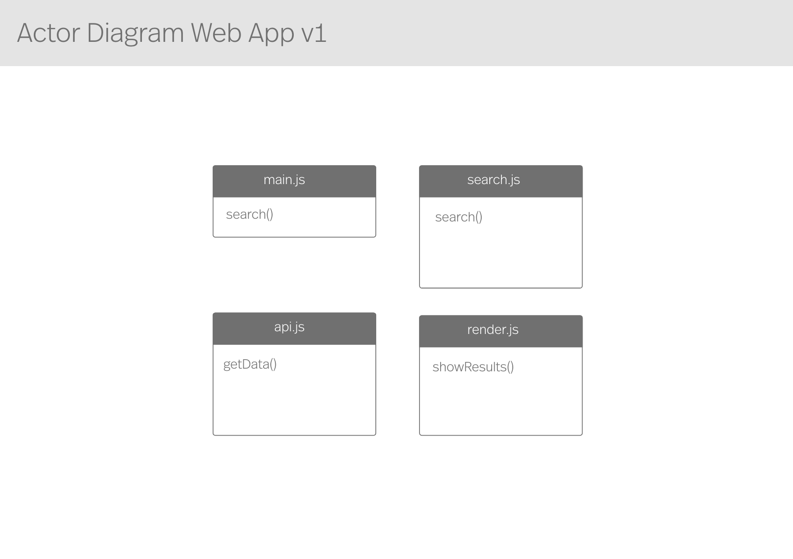
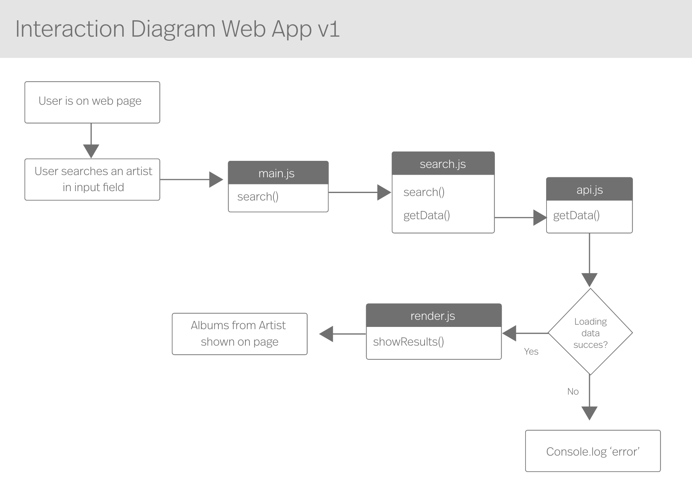

# Web App From Scratch @cmda-minor-web 2020 - 2021 

In this course, i learn to build a web application with vanilla HTML, CSS and Javascript. I will learn how to retrieve data from an API of my own choosing and how i can write vanilla Javascript.

## Table of contents

- [Web App - Album Library 🎶](#web-app---album-libray-)
    * [Web Application Link](#web-application-link)
    * [Process 📈](#process-)
- [API - LastFM 🎵](#api---music-lastfm-)
- [Diagrams 🗂](#diagrams-)
    * [Actor Diagram](#actor-diagram)
    * [Interaction Diagram](#interaction-diagram)
- [Javascript Fundamentels](#javascript-fundamentels-)
- [installation guide ⬇️](#installation-guide-%EF%B8%8F)
- [Sources](#sources) 
- [Acknowledgments](#Acknowledgments) 

## Web App - Album Libray 🎶
In this web app you can find top albums of your favorite artists. And you can find more information and songs from that album. 

### Web App Link 
You can find the web app [here](https://sanneduinkerx.github.io/web-app-from-scratch-2021/).

### Process 📈
The **process** of web app can be found [here](https://github.com/sanneduinkerx/web-app-from-scratch-2021/wiki/Proces).

## API - LastFM 🎵

I've chosen the LastFM API and load the top albums from artists. The user can search for favorite artists and get top albums from that artist. Info about the API can be found [here](https://www.last.fm/api/show/artist.getTopAlbums). 

## Diagrams 🗂
The Diagrams will change over time in this project when more actors are added later on.

### Actor Diagram
<!--  versie 1 -->

### Interaction Diagram

## Javascript Fundamentels 🔨

## installation guide ⬇️

## Sources 
Used sources to make web application:

- Using fetch - MDN Web Docs, [https://developer.mozilla.org/en-US/docs/Web/API/Fetch_API/Using_Fetch](https://developer.mozilla.org/en-US/docs/Web/API/Fetch_API/Using_Fetch) 
- Routie a tiny has router - Greg Allen 2016, [http://projects.jga.me/routie](http://projects.jga.me/routie)
- Understanding client side routing by implementing a router - Will Taylor Blog, [https://www.willtaylor.blog/client-side-routing-in-vanilla-js/](https://www.willtaylor.blog/client-side-routing-in-vanilla-js/)
- https://medium.com/swlh/lets-code-a-client-side-router-for-your-no-framework-spa-19da93105e10
- https://developer.mozilla.org/en-US/docs/Web/HTML/Element/script
- https://stackoverflow.com/questions/59394620/why-fetch-returns-promise-pending
- https://stackoverflow.com/questions/55458675/filter-is-not-a-function
- https://www.w3schools.com/js/js_string_methods.asp
- https://developer.mozilla.org/en-US/docs/Web/JavaScript/Reference/Global_Objects/Array/unshift

## Acknowledgments
A shoutout to team [Roodbots](https://bvictorb.github.io/teampagina/) 🙌🏼 for helping, ideas and giving good feedback to my web application. 

<!-- How about a section that describes how to install this project? 🤓 -->

<!-- How about a license here? 📜 (or is it a licence?) 🤷 -->
